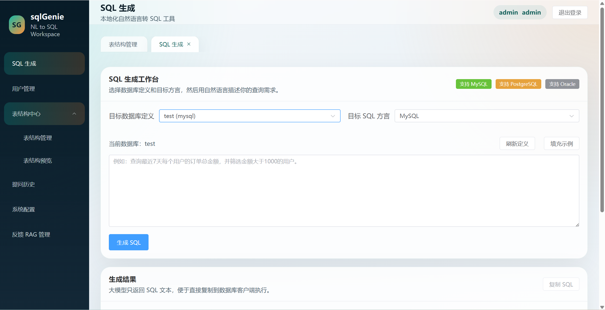
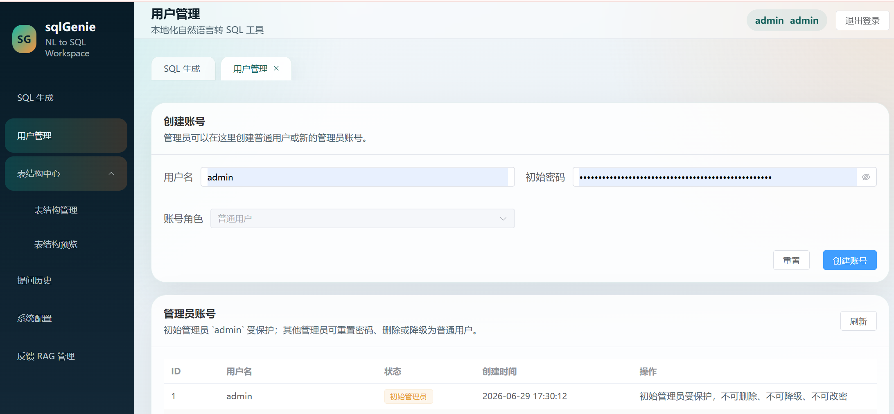
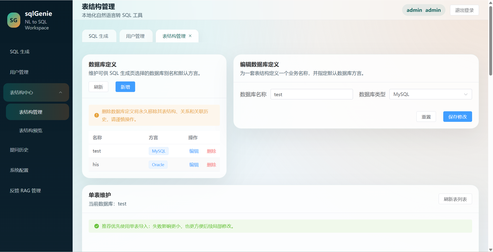
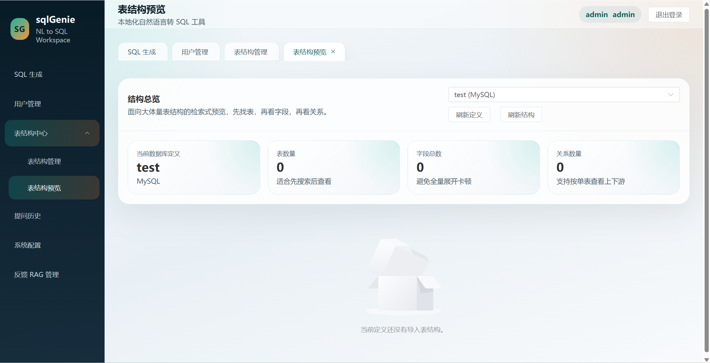
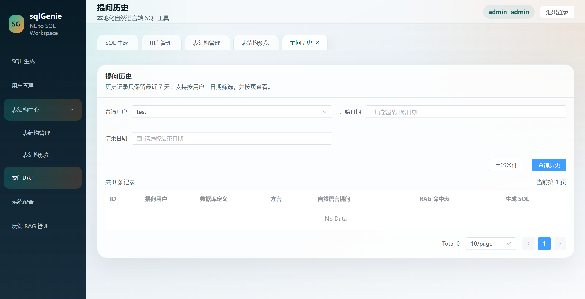
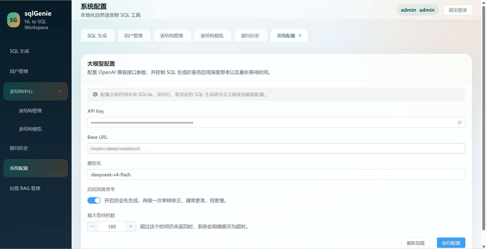
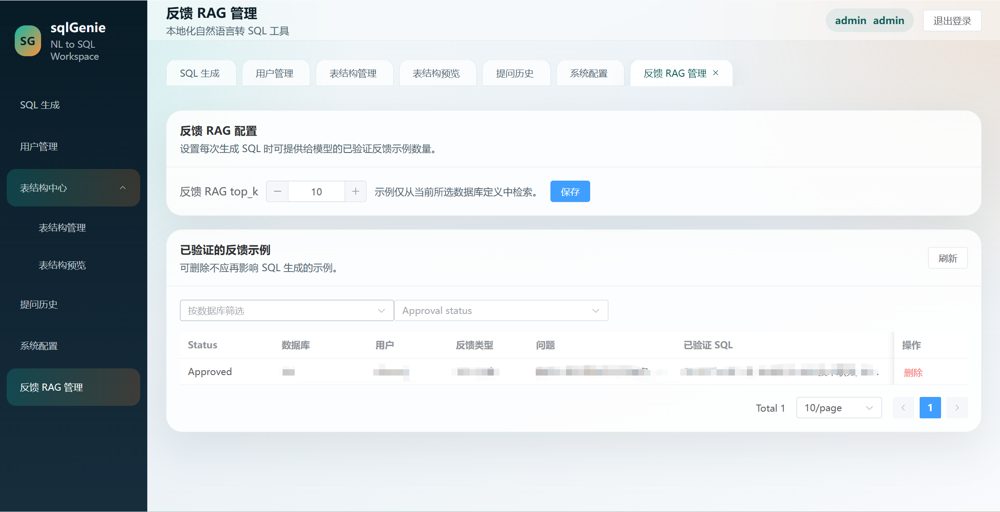

# sqlGenie

## Interface preview

### SQL workbench



### User management



### Schema management



### Schema preview



### Query history



### Model configuration



### Feedback RAG management



## Security configuration

The default launch mode binds to localhost. Before setting `APP_HOST` or
`VITE_HOST` to a non-loopback address, set unique, strong `SECRET_KEY` and
`ADMIN_PASSWORD` values in `.env`; startup rejects the known development
defaults when the API is exposed on the network.

## Deployment guide

This project stores operational data locally. Never commit `.env`, `*.db`,
`.chroma/`, logs, dependency directories, or generated frontend assets. The
provided `.gitignore` excludes them by default.

### 1. Prerequisites

- Python 3.10 or newer
- Node.js 20 LTS or newer
- pnpm 9 or newer (or enable it with `corepack enable`)
- An OpenAI-compatible Chat Completions endpoint and API key

### 2. Configure the application

Copy the example configuration and replace every placeholder before exposing
the service on a network:

```bash
copy .env.example .env        # Windows
# cp .env.example .env        # Linux/macOS
```

Set at least the following values in `.env`:

```dotenv
APP_HOST=127.0.0.1
APP_PORT=8000
SECRET_KEY=<a-unique-long-random-value>
ADMIN_USERNAME=admin
ADMIN_PASSWORD=<a-strong-unique-password>
LLM_API_KEY=<provider-api-key>
LLM_BASE_URL=https://api.openai.com/v1
LLM_MODEL=gpt-4o-mini
```

Keep `APP_HOST=127.0.0.1` when a reverse proxy is used. For direct LAN access,
set `APP_HOST=0.0.0.0` only after setting strong credentials. The application
refuses known default credentials on a non-loopback listener.

### 3. Local development

Create and activate a virtual environment, then install backend dependencies:

```bash
python -m venv .venv
# Windows PowerShell: .\.venv\Scripts\Activate.ps1
# Linux/macOS: source .venv/bin/activate
pip install -r backend/requirements.txt
```

Install and run the frontend in another terminal:

```bash
cd frontend
corepack enable
pnpm install --frozen-lockfile
pnpm dev
```

Run the API from the repository root in the first terminal:

```bash
uvicorn main:app --reload --host 127.0.0.1 --port 8000
```

Open `http://127.0.0.1:5173`. The Vite development server proxies `/api` to
the backend.

### 4. Windows packaged workflow

On the Windows workstation where the bundled runtimes are configured, use:

```bat
build.cmd
start.cmd --no-browser
restart.cmd rebuild --no-browser
stop.cmd
```

`restart.cmd rebuild --no-browser` stops the running SQLGenie processes,
compiles the backend, builds the frontend, starts the API, and waits for the
health endpoint. The service is available at `http://127.0.0.1:8000/`.

### 5. Linux production deployment

Build the frontend once before starting the backend. FastAPI serves
`frontend/dist` when it exists:

```bash
git clone https://github.com/alikatong/SQLGenie.git /opt/sqlgenie
cd /opt/sqlgenie
python3 -m venv .venv
source .venv/bin/activate
pip install --upgrade pip
pip install -r backend/requirements.txt
cp .env.example .env
# Edit .env and set the strong credentials and LLM settings described above.
cd frontend
corepack enable
pnpm install --frozen-lockfile
pnpm build
cd ..
```

Create `/etc/systemd/system/sqlgenie.service`:

```ini
[Unit]
Description=SQLGenie
After=network.target

[Service]
Type=simple
User=sqlgenie
WorkingDirectory=/opt/sqlgenie
Environment=PYTHONPATH=/opt/sqlgenie
ExecStart=/opt/sqlgenie/.venv/bin/uvicorn main:app --host 127.0.0.1 --port 8000
Restart=on-failure
RestartSec=5

[Install]
WantedBy=multi-user.target
```

Start it with:

```bash
sudo systemctl daemon-reload
sudo systemctl enable --now sqlgenie
sudo systemctl status sqlgenie
curl http://127.0.0.1:8000/api/health
```

### 6. Nginx and TLS

Keep SQLGenie bound to localhost and terminate HTTPS in Nginx. A minimal
server block is:

```nginx
server {
    listen 80;
    server_name sqlgenie.example.com;

    location / {
        proxy_pass http://127.0.0.1:8000;
        proxy_http_version 1.1;
        proxy_set_header Host $host;
        proxy_set_header X-Forwarded-For $proxy_add_x_forwarded_for;
        proxy_set_header X-Forwarded-Proto $scheme;
    }
}
```

Use Certbot or your organization's certificate process to add TLS. When the
frontend runs on a separate origin in development, set `CORS_ORIGINS` to the
exact allowed origins. Do not use a wildcard origin with credentialed requests.

### 7. Data, backup, and upgrades

`sqlgenie.db` contains users, database metadata, history, and feedback. The
`.chroma/` directory contains the vector index. Stop the service before making
a consistent backup:

```bash
sudo systemctl stop sqlgenie
tar -czf sqlgenie-backup-$(date +%F).tgz sqlgenie.db .chroma .env
sudo systemctl start sqlgenie
```

For an upgrade, back up those files, pull the new source, update Python and
frontend dependencies, rebuild the frontend, then restart the service. Do not
replace `.env`, `sqlgenie.db`, or `.chroma/` with files from Git.

基于大模型的本地化 SQL 生成工具，支持管理员维护多数据库结构元数据，普通用户通过自然语言生成 MySQL、PostgreSQL、Oracle SQL。

## 技术栈

- 前端：Vue 3 + Vite + Element Plus
- 后端：FastAPI + SQLite
- RAG 检索：ChromaDB + sentence-transformers `BAAI/bge-small-zh-v1.5`
- DDL 处理：sqlglot
- 认证：JWT
- 大模型接口：OpenAI 兼容 Chat Completions API

## 已实现能力

- 用户登录与 JWT 鉴权
- 首次启动自动初始化 SQLite，并创建默认管理员 `admin / admin123`
- 管理员创建普通用户
- 管理员删除普通用户、重置普通用户密码
- 数据库定义管理
- 表结构 JSON 幂等导入
- 表结构、字段、关系查询
- 基于 Chroma 的表结构 RAG 检索，支持 Top-K 语义召回、外键扩展和关键词补召回
- 大模型配置管理
- 基于 RAG 表结构上下文的自然语言转 SQL
- 普通用户提问历史记录，管理员可按用户和时间范围查询，且仅保留最近 7 天
- 普通用户 / 管理员分角色前端导航

## 项目结构

```text
SQLGenie/
├── backend/
│   ├── auth.py
│   ├── config.py
│   ├── crud.py
│   ├── database.py
│   ├── llm.py
│   ├── main.py
│   ├── models.py
│   ├── rag.py
│   ├── requirements.txt
│   └── schemas.py
├── examples/
│   └── schema-upload.json
├── frontend/
│   ├── package.json
│   ├── vite.config.js
│   └── src/
│       ├── api/
│       ├── router/
│       ├── stores/
│       └── views/
├── main.py
└── .env.example
```

## 后端启动

1. 准备 Python 3.10+
2. 安装依赖：

```bash
pip install -r backend/requirements.txt
```

3. 创建环境文件：

```bash
copy .env.example .env
```

4. 启动服务：

```bash
uvicorn main:app --reload --port 8000
```

服务启动后会自动创建 `sqlgenie.db`。
RAG 向量索引默认持久化到项目根目录下的 `.chroma/`。

如需让局域网内其他电脑访问，可使用：

```bash
uvicorn main:app --reload --host 0.0.0.0 --port 8000
```

This explicit network binding requires strong non-default `SECRET_KEY` and `ADMIN_PASSWORD` values; startup rejects insecure settings.

启动后，局域网内其他设备可通过 `http://你的电脑IP:8000/` 访问。

## 前端启动

1. 进入前端目录并安装依赖：

```bash
cd frontend
npm install
```

2. 启动开发服务器：

```bash
npm run dev
```

默认通过 Vite 代理将 `/api` 转发到 `http://127.0.0.1:8000`。

## RAG 流程

1. 管理员导入表结构后，后端会根据 `table_meta / column_meta / table_relation` 自动生成单表 DDL。
2. 每张表会生成一段结构化描述文本，用于本地语义检索。
3. 后端把描述文本写入 Chroma，把 DDL、外键信息和哈希版本保存到 SQLite 的 `schema_rag_index`。
4. 用户提问时，系统先做 Top-K 语义召回，再按外键扩展一层；如果命中不足，会退化到表名 / 注释 / 字段名关键词补召回。
5. 最终只把命中的相关表 DDL 拼到 Prompt 中，再调用大模型生成 SQL。

说明：

- 默认嵌入模型为 `BAAI/bge-small-zh-v1.5`
- 默认 Top-K 为 `30`
- 默认外键扩展深度为 `1`
- 如果本地暂未安装 `chromadb` 或 `sentence-transformers`，系统会自动退化为关键词召回，不会阻断 SQL 生成

## 一键脚本

Windows 下可以直接双击项目根目录里的脚本：

- `启动服务.cmd`：启动 sqlGenie，并自动打开首页
- `停止服务.cmd`：停止 8000/5173 端口上的 sqlGenie 服务
- `重启服务.cmd`：先停止再重新启动 sqlGenie
- `start.cmd` / `stop.cmd` / `restart.cmd`：与上面三者等价，兼容性更好

默认情况下，启动脚本会让后端监听 `127.0.0.1:8000`。如需局域网访问，请显式设置 `APP_HOST` 和 `VITE_HOST`，并先配置强随机的 `SECRET_KEY` 与 `ADMIN_PASSWORD`。

## JSON 导入示例

参考 [examples/schema-upload.json](examples/schema-upload.json)。

### relations 如何构建

`relations` 里的每一项都表示一条表关系，结构如下：

```json
{
  "from_table": "主表名",
  "from_column": "主表字段",
  "to_table": "子表名",
  "to_column": "子表外键字段",
  "relation_type": "one_to_many"
}
```

推荐按“被引用端 -> 外键端”来写，也就是：

- `from_table` / `from_column`：被引用的一端，通常是主键或唯一键所在表
- `to_table` / `to_column`：引用别人的一端，通常是外键字段所在表
- `relation_type`：关系类型，当前可直接写成 `one_to_many`

例如：一个用户有多个订单，订单表里的 `user_id` 指向用户表里的 `id`，应该写成：

```json
{
  "from_table": "users",
  "from_column": "id",
  "to_table": "orders",
  "to_column": "user_id",
  "relation_type": "one_to_many"
}
```

### 单表导入时 relations 怎么写

单表导入接口的 `relations` 只需要填写“和当前表有关”的关系，不需要把全库所有关系都传一遍。

如果当前导入的是 `orders` 表，而它通过 `user_id` 关联 `users.id`，可以这样写：

```json
{
  "table": {
    "table_name": "orders",
    "table_comment": "订单表",
    "columns": [
      { "column_name": "id", "data_type": "int", "column_comment": "主键" },
      { "column_name": "user_id", "data_type": "int", "column_comment": "下单用户ID" },
      { "column_name": "amount", "data_type": "decimal(10,2)", "column_comment": "订单金额" }
    ]
  },
  "relations": [
    {
      "from_table": "users",
      "from_column": "id",
      "to_table": "orders",
      "to_column": "user_id",
      "relation_type": "one_to_many"
    }
  ]
}
```

注意：

- 单表导入时，`relations` 中的每条关系都必须包含当前表
- 关系两端的表都必须已经存在
- 关系里引用到的字段也必须已经存在

## API 概览

- `POST /api/login`
- `GET /api/db-defs`
- `POST /api/db-defs`
- `PUT /api/db-defs/{id}`
- `DELETE /api/db-defs/{id}`
- `POST /api/db-defs/{db_id}/tables`
- `GET /api/db-defs/{db_id}/tables`
- `POST /api/generate-sql`
- `GET /api/config`
- `PUT /api/config`

## 说明

- `GET /api/db-defs` 对登录用户开放，便于 SQL 生成页加载数据库定义。
- 大模型调用使用 OpenAI 兼容接口的 `/chat/completions`。
- 表结构导入采用“先删后插”策略，保证同一 `db_id` 下幂等更新。
- `/api/generate-sql` 会额外返回 `retrieved_tables` 和 `retrieval_mode`，用于展示本次 RAG 命中的表。
